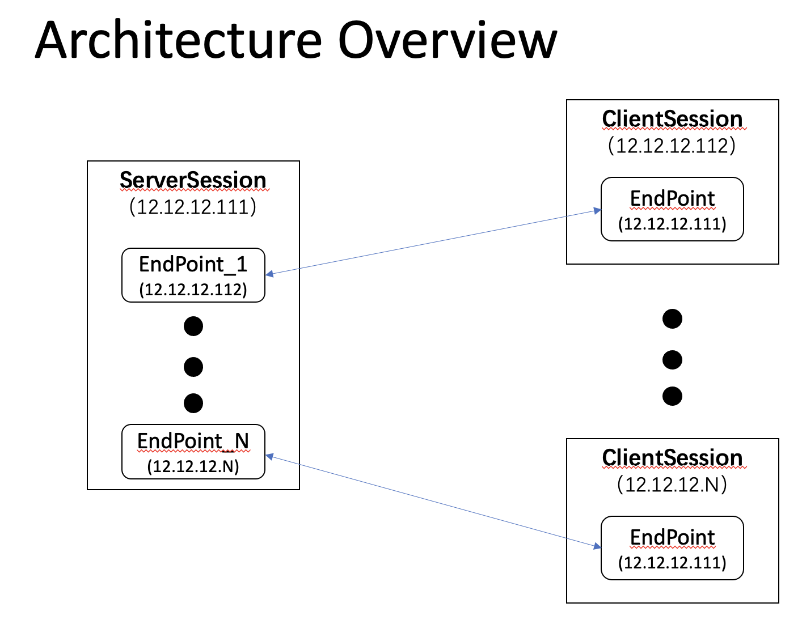
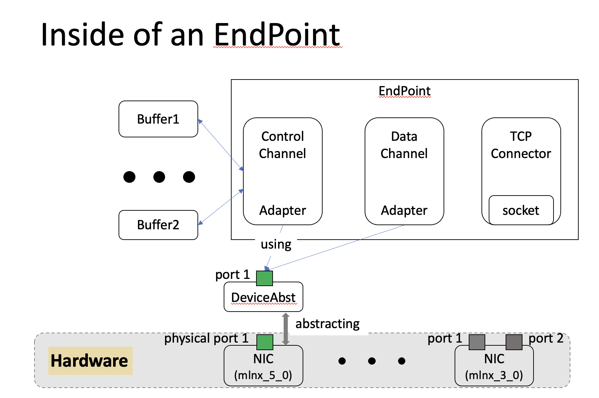

# Introduction

[rdma_comm_core](https://github.com/NEWPLAN/rdma_comm_core) is a wrapper of rdma communication primitives implemented in the C++ programming language, which includes `SEND`, `RECV`, `WRITE`, `READ`, `WRITE_WITH_IMM`. It support multiple `work request` processed concurrently to maximun the performance.

[rdma_comm_core](https://github.com/NEWPLAN/rdma_comm_core) works for the Linux platform and tested on Ubuntu 1604.


# Basic Design

## Work Mode
In general, RDMA works in the asynchronous event-driven fashion for high performance, and [rdma_comm_core](https://github.com/NEWPLAN/rdma_comm_core) supports three basic working modes. 

- **`polling-aggressively`**: In this mode, thread(s) would proactively poll the `completion queue` without blocking to fetch the executing result (success or failure) of work requests submitted before. Application working in this mode may be latency-sensitive, accordingly, CPU resources are required.
- **`completion channel`**: In this mode, the thread(s) to fetch the results would be stuck in the function ([ibv_get_cq_event](https://github.com/linux-rdma/rdma-core/blob/aa0fda8580149bdaf5138d7a2891011c10fe6701/libibverbs/verbs.h#L2829)) until waked up by a new incoming event(success or failure). Application working in this mode can save many CPU resources, accordingly, the processing latency increases.
- **`epoll`**: In this mode, users can set a global `epoll` resource to listen to the event for a group of `completion queues` while not being blocked by the API. By setting a timeout, the polling thread can be released to process other workflows despite no new incoming events.

## Thread Mode 
[rdma_comm_core](https://github.com/NEWPLAN/rdma_comm_core) is based on thread mode. Currently, it supports two thread modes as follows:
- **`Per-thread-per-QPair`**: In this mode, assign a private thread to each QPair to track the work request state in their completion queues.
- **`Shared-CQ`**: In this mode, multiple QPairs may share a global `completion queue(CQ)` to track the ```wqe``` executing status.

The Thread Mode is configured in [void lazy_config_hca()](https://github.com/NEWPLAN/rdma_comm_core/blob/abf254743b137640849ff5fc8dffa524102e956f/include/rdma_session.h#L51), which should be implemented by sub-class.


## Architecture Overview
The architecture overview of [rdma_comm_core](https://github.com/NEWPLAN/rdma_comm_core) is shown below.



 There are two roles distinguished in [rdma_comm_core](https://github.com/NEWPLAN/rdma_comm_core).

- ```ServerSession``` is inherited from ```RDMASession``` and handles the workflow of server sides, such as listen to and accept new connection requests. Once a new connection request is detected, the ```ServerSession``` would allocate corresponding resources and interacts with the client side to establish the connection.
- ```ClientSession``` is inherited from ```RDMASession``` and handles the workflow of client sides. It interacts with ```ServerSession```  to finish the connection.

Both ```ServerSession```  and ```ClientSession``` use ```EndPoint``` to identify the connection. Differently, ```ServerSession```  may have multiple ```EndPoint```s to deal with different connections individually, while there is only an ```EndPoint``` in the ```ClientSession``` to deal with data exchange with the server side.

## Dive into an ```EndPoint```

[rdma_comm_core](https://github.com/NEWPLAN/rdma_comm_core) allocates an individual ```EndPoint``` to manage each connection in both ```ClientSession``` and ```ServerSession``` once a connection request is generated/detected.
Below is the inside of an ```EndPoint```.


## Basic Components
Before showing how EndPoint works, we would introduce each component first.
- ```RDMADevice``` is the abstraction of RDMA device, and each instance is bound to the hardware device(e.g., NIC) and provides basic services, such as ```query/modify device attributes/status```, ```SEND```, ```RECV```, ```WRITE(-WITH_IMM)```, ```READ```, manage the context/resources of hardware, etc.
- ```RDMAAdapter``` is the lower abstraction of an RDMA connection context. It is instanced once a connection is launched and interacts with ```RDMADevice``` to process and connection workflow.
- ```RDMAChannel``` is the higher abstraction of an RDMA connection context. It is inherited from ```RDMAAdapter``` and interacts with applications to process and user-space workflow.
- ```TCPConnector``` is a wrapper of ```TCP Socket``` and serves as a helper to exchange necessary information when establishing the RDMA connection.
- ```RDMABuffer``` is the memory manager exposed to the upper applications to provide placeholders for communication workflow.

## Organization
- There is at least one ```TCPConnector``` owned by an ```EndPoint``` as a helper when establishing the connections. 
- Additionally, there may be one or more ```RDMAChannel``` in an ```EndPoint``` to address different communication services.
- All communication requests from the upper application are submitted to ```RDMAAdapter``` by ```RDMAChannel``` and finally processed by ```RDMADevice```.


# Installation and Usages
There are three examples included in the repository, located in the subdirectory named `example`.
## Requirements
[rdma_comm_core](https://github.com/NEWPLAN/rdma_comm_core) uses customized log and backtraces that may require installation before use. All related third libraries are listed as follows.
- ```cmake``` is used as the project management system, [rdma_comm_core](https://github.com/NEWPLAN/rdma_comm_core) requires a [cmake](https://github.com/Kitware/CMake/releases/download/v3.21.3/cmake-3.21.3.tar.gz) with version(>=3.18) to simplify the compiling process.
- ```google-glog``` is a popular log system. [rdma_comm_core](https://github.com/NEWPLAN/rdma_comm_core) uses the ```RLOG``` customized from [google-glog](https://github.com/google/glog) to show the execution process with different levels (specified by ```RCL_MAX_VLOG_LEVEL=XXX```)
- ```backward-cpp``` is a popular backtracing subsystem. [rdma_comm_core](https://github.com/NEWPLAN/rdma_comm_core) uses ```backtrace_service``` customized from [backward-cpp](https://github.com/bombela/backward-cpp) to address the runtime exception.
- ```gcc/g++``` is used in [rdma_comm_core](https://github.com/NEWPLAN/rdma_comm_core) as the default compiler. Particularly, the version of ```gcc/g++``` should be >= [9.3.0](https://ftp.gnu.org/gnu/gcc/gcc-9.3.0/) to support the ```C++``` grammar used in [rdma_comm_core](https://github.com/NEWPLAN/rdma_comm_core).
  
## Examples
- ```ping_pong_test``` is a connection test for any rdma connection pair. It uses default processing workflows on server and client sides.
- ```lat_bw_benchmark``` is a customized benchmark to evaluate the latency and throughput of RDMA communication primitives (including ```SEND```, ```RECV```, ```WRITE```, ```READ```), by re-implementing the ```RDMAClientSession``` and ```RDMAServerSession```.
- ```mesh_comm_service``` is a full-mesh communication test among N nodes, where each has ```N-1``` ```ClientSession``` and a ```ServerSession``` to WRITE/RECV data simultaneously.

## Run Example 
We Run the ```lat_bw_benchmark``` as the example to show the whole workflow:

### compile
```shell
mkdir build; cd build; cmake .. -GNinja; ninja;
```
### Run Server
```shell
~/t/F/3/r/build (main)> RCL_MAX_VLOG_LEVEL=3 ./lat_bw_benchmark --role=master
RCL_MAX_VLOG_LEVEL is set to 3, indicating level in VLOG (level) less than 3 would show
WARNING: Logging before InitGoogleLogging() is written to STDERR
I0923 18:30:27.148751 17905 rdma_session.cc:36] Creating a new RDMASession for
I0923 18:30:27.149014 17905 rdma_server_sess.cc:15] Creating a new RDMAServerSession for ConnectionTest
I0923 18:30:27.149031 17905 lat_bw_benchmark.cc:523] Creating SchedulingServer
I0923 18:30:27.149052 17905 tcp_connector.cc:118] Preparing socket for RDMAServerSession
I0923 18:30:27.149076 17905 tcp_connector.cc:123] Creating a socket: 3 for RDMAServerSession
[INFO] Having modified IP ToS for socket: 3 from 0x0(old) to 0x10(new)
[INFO] Having modified IP priority for socket: 3 from 6(old) to 4(new)
[INFO] Having set IP port resue
I0923 18:30:27.149133 17905 tcp_connector.cc:128] [Done] Preparing socket...
I0923 18:30:27.149145 17905 rdma_server_sess.cc:29] RDMAServer is preparing everything for accepting new connections
I0923 18:30:27.149181 17905 rdma_server_sess.cc:46] The server is listening on 2020
I0923 18:30:32.648588 17905 rdma_session.cc:156] Handles new connect request by @ConnectionTest
I0923 18:30:32.648682 17905 rdma_session.cc:159] the remote info of connection request is 12.12.12.113:60878
I0923 18:30:32.648783 17905 rdma_endpoint.cc:23] Create RDMAEndPoint
I0923 18:30:32.648993 17905 rdma_endpoint.cc:29] Connection Test OK for TCPConnector@RDMAEndPoint@[12.12.12.111:2020-->12.12.12.113:60878]@@ConnectionTest
I0923 18:30:32.649061 17905 rdma_endpoint.cc:91] creating&preparing an rdma channel for DataChannel
I0923 18:30:32.649116 17905 rdma_adapter.cc:20] Creating a (virtual) adapter for DataChannel
I0923 18:30:32.649149 17905 rdma_channel.cc:10] Creating RDMAChannel with id: DataChannel
I0923 18:30:32.649423 17905 rdma_server_sess.cc:61] received connection: 1/0
I0923 18:30:32.749850 17906 rdma_adapter.cc:45] RDMAAdapter@(DataChannel)[12.12.12.111:2020-->12.12.12.113:60878]@@ConnectionTest would not use shared_cq, the cq is: RDMAAdapter@(DataChannel)[12.12.12.111:2020-->12.12.12.113:60878]@@ConnectionTest
I0923 18:30:32.749887 17906 rdma_adapter.cc:47] Preparing the resources of RDMAAdapter@(DataChannel)[12.12.12.111:2020-->12.12.12.113:60878]@@ConnectionTest
I0923 18:30:32.749915 17906 rdma_device.cc:102] Try to get the RDMADevice(mlx5_0) for RDMAAdapter@(DataChannel)[12.12.12.111:2020-->12.12.12.113:60878]@@ConnectionTest
I0923 18:30:32.749997 17906 rdma_device.cc:108] Warning: RDMADevice (mlx5_0) do not exist
I0923 18:30:32.750052 17906 rdma_device.cc:67] Creating RDMADevice(mlx5_0)
I0923 18:30:32.750072 17906 rdma_device.cc:128] The sys params are: cache_line: 64, page_size: 4096
I0923 18:30:32.750319 17906 rdma_device.cc:205] found 1 device(s)
I0923 18:30:32.757339 17906 rdma_device.cc:136] Open device (mlx5_0@0x7fd2fdc2c150)
I0923 18:30:32.757390 17906 rdma_device.cc:150] RDMADevice(mlx5_0) has 1 physical ports
I0923 18:30:32.757695 17906 rdma_device.cc:177] Info on (1)th port of RDMADevice(mlx5_0) is:
port_state: 4, max_mtu: 5, activate_mtu: 3, lid: 0, sm_lid: 0, link_layer=2.
For more details, please ref to[https://github.com/linux-rdma/rdma-core/blob/486ecb3f12ab17e4b7970a6d5444cd165cec6ee4/libibverbs/verbs.h#L423]
I0923 18:30:32.757964 17906 rdma_device.cc:74] Try to register an RDMAAdapter in RDMADevice(mlx5_0)
I0923 18:30:32.758067 17906 rdma_device.cc:86] [Success]: Register RDMAAdapter@(DataChannel)[12.12.12.111:2020-->12.12.12.113:60878]@@ConnectionTest into RDMADevice(mlx5_0)
I0923 18:30:32.758093 17906 rdma_device.cc:119] return RDMADevice(mlx5_0) for RDMAAdapter@(DataChannel)[12.12.12.111:2020-->12.12.12.113:60878]@@ConnectionTest
I0923 18:30:32.758273 17906 rdma_adapter.cc:97] Creating protection domain(0x7fd2f4000c40) for RDMAAdapter@(DataChannel)[12.12.12.111:2020-->12.12.12.113:60878]@@ConnectionTest
I0923 18:30:32.758309 17906 rdma_adapter.cc:189] RDMAAdapter@(DataChannel)[12.12.12.111:2020-->12.12.12.113:60878]@@ConnectionTest works in active model, i.e., poll it dramatically
I0923 18:30:32.758383 17906 rdma_device.cc:301] Trying to find the completion queue(CQ), named RDMAAdapter@(DataChannel)[12.12.12.111:2020-->12.12.12.113:60878]@@ConnectionTest in RDMADevice(mlx5_0)
I0923 18:30:32.759755 17906 rdma_device.cc:321] CQ, named RDMAAdapter@(DataChannel)[12.12.12.111:2020-->12.12.12.113:60878]@@ConnectionTest is not found in RDMADevice(mlx5_0), create one (0x7fd2f4001470) now!
I0923 18:30:32.759783 17906 rdma_adapter.cc:132] The CQ@RDMAAdapter@(DataChannel)[12.12.12.111:2020-->12.12.12.113:60878]@@ConnectionTest (@0x7fd2f4001470) is privated
I0923 18:30:32.759793 17906 rdma_adapter.cc:64] Trying to create QPair@RDMAAdapter@(DataChannel)[12.12.12.111:2020-->12.12.12.113:60878]@@ConnectionTest
W0923 18:30:32.759810 17906 rdma_adapter.cc:76] CQ@RDMAAdapter@(DataChannel)[12.12.12.111:2020-->12.12.12.113:60878]@@ConnectionTest would not generate a signal for sqe
I0923 18:30:32.761607 17906 rdma_adapter.cc:88] [OK]: Successfully create queue_pair(0x7fd2f4001738) for RDMAAdapter@(DataChannel)[12.12.12.111:2020-->12.12.12.113:60878]@@ConnectionTest
I0923 18:30:32.761658 17906 rdma_adapter.cc:147] Updating the info of RDMAAdapter@(DataChannel)[12.12.12.111:2020-->12.12.12.113:60878]@@ConnectionTest
W0923 18:30:32.761695 17906 rdma_adapter.cc:157] The actived mtu(3) is less than the config (5), reset it
I0923 18:30:32.761936 17906 rdma_adapter.cc:221] RDMAAdapter@(DataChannel)[12.12.12.111:2020-->12.12.12.113:60878]@@ConnectionTest is trying to connect to the remote (i.e., RDMAAdapter@(DataChannel)[12.12.12.113:60878-->12.12.12.111:2020]@slaver@ConnectionTest)
=====================================================================
=  Local Adapter ID 	= RDMAAdapter@(DataChannel)[12.12.12.111:2020-->12.12.12.113:60878]@@ConnectionTest
=  Remote Adapter ID 	= RDMAAdapter@(DataChannel)[12.12.12.113:60878-->12.12.12.111:2020]@slaver@ConnectionTest
=  Local QP number = 0x2f,	Remote QP number = 0x737c
=  Local LID 	= 0x0,		Remote LID 	= 0x0
=  Self GID 	= 00:00:00:00:00:00:00:00:00:00:ff:ff:0c:0c:0c:6f
=  Remote GID 	= 00:00:00:00:00:00:00:00:00:00:ff:ff:0c:0c:0c:71
=====================================================================
I0923 18:30:32.761981 17906 rdma_adapter.cc:340] Modifying QP to INIT, preparing to work
I0923 18:30:32.762881 17906 rdma_device.cc:277] Querying the attr of QP (0x7fd2f4001738) in RDMADevice(mlx5_0)
I0923 18:30:32.763243 17906 rdma_adapter.cc:140] Show the qp info in (INIT):
qp_state: 1, mtu: 1
I0923 18:30:32.763267 17906 rdma_adapter.cc:289] Modify QP to RTR, ready to receive
I0923 18:30:32.763274 17906 rdma_adapter.cc:299] Configuure the path_mtu to: 3
I0923 18:30:32.763280 17906 rdma_adapter.cc:316] Using RoCE
W0923 18:30:32.763285 17906 rdma_adapter.cc:326] Using traffic class 0
I0923 18:30:32.764590 17906 rdma_device.cc:277] Querying the attr of QP (0x7fd2f4001738) in RDMADevice(mlx5_0)
I0923 18:30:32.764794 17906 rdma_adapter.cc:140] Show the qp info in (RTR):
qp_state: 2, mtu: 3
I0923 18:30:32.764815 17906 rdma_adapter.cc:265] Modify QP to RTS, ready to send
I0923 18:30:32.765151 17906 rdma_device.cc:277] Querying the attr of QP (0x7fd2f4001738) in RDMADevice(mlx5_0)
I0923 18:30:32.765313 17906 rdma_adapter.cc:140] Show the qp info in (RTS):
qp_state: 3, mtu: 3
I0923 18:30:32.766242 17907 rdma_buffer.cc:139] Creating buffer : benchmark_buffer
I0923 18:30:32.766312 17907 rdma_buffer.cc:148] [OK] allocating mem for (benchmark_buffer):  @0x7fd0fffff000, with size: 8388608000
I0923 18:30:32.766335 17907 rdma_buffer.cc:152] Spliting the buffer benchmark_buffer into 1000 piece(s)
I0923 18:30:32.770346 17907 rdma_channel.cc:39] Registering buffer (name = benchmark_buffer, size = 8388608000) into RDMAChannel@(DataChannel)[12.12.12.111:2020-->12.12.12.113:60878]@@ConnectionTest
W0923 18:30:32.770390 17907 rdma_device.cc:598] No flags for the mem buf (benchmark_buffer), using the default access mode: (IBV_ACCESS_LOCAL_WRITE | IBV_ACCESS_REMOTE_READ | IBV_ACCESS_REMOTE_WRITE)
I0923 18:30:35.856914 17907 rdma_device.cc:617] [OK] register mem for (benchmark_buffer):  @0x7fd0fffff000, with size: 8388608000, and flags: 0x7, lkey: 0x6e00, rkey: 0x6e00
I0923 18:30:35.857262 17907 rdma_device.cc:437] Post receive request to RQ
I0923 18:30:35.857275 17907 lat_bw_benchmark.cc:425] Register buffer for test@@ConnectionTest
I0923 18:30:36.065896 17907 rdma_device.cc:383] polled wqe: 1
I0923 18:30:36.065971 17907 rdma_device.cc:394] Post send request to SQ
I0923 18:30:36.065997 17907 lat_bw_benchmark.cc:465] Exchange buffer Done
I0923 18:30:46.022114 17905 lat_bw_benchmark.cc:527] Destroy SchedulingServer
I0923 18:30:46.022150 17905 rdma_server_sess.cc:21] Destroying the RDMAServerSession of @ConnectionTest
I0923 18:30:46.022171 17905 rdma_session.cc:55] Destroying the RDMASession of @ConnectionTest
I0923 18:30:46.022207 17905 rdma_endpoint.cc:10] Destroy RDMAEndPoint
I0923 18:30:46.268671 17905 rdma_device.cc:633] Successfully deregister mem for benchmark_buffer
I0923 18:30:46.268790 17905 rdma_channel.cc:63] Buffer(benchmark_buffer) has been removed from RDMAChannel@(DataChannel)[12.12.12.111:2020-->12.12.12.113:60878]@@ConnectionTest
I0923 18:30:46.268828 17905 rdma_channel.cc:25] Destroying RDMAChannel with id: DataChannel
I0923 18:30:46.268864 17905 rdma_adapter.cc:12] RDMAAdapter is released
I0923 18:30:46.269376 17905 rdma_device.cc:60] RDMADevice(mlx5_0) is released
~/t/F/3/r/build (main)>
```
### Run Client
```shell 
~/t/F/3/r/build (main)> RCL_MAX_VLOG_LEVEL=3 ./lat_bw_benchmark --role=slaver --master=12.12.12.111
RCL_MAX_VLOG_LEVEL is set to 3, indicating level in VLOG (level) less than 3 would show
WARNING: Logging before InitGoogleLogging() is written to STDERR
I0923 18:30:32.639127 56562 rdma_session.cc:36] Creating a new RDMASession for slaver
I0923 18:30:32.639392 56562 rdma_client_sess.cc:16] Creating a new RDMAClientSession for ConnectionTest
I0923 18:30:32.639410 56562 lat_bw_benchmark.cc:335] Creating SchedulingClient
I0923 18:30:32.639456 56562 tcp_connector.cc:118] Preparing socket for RDMAClientSession
I0923 18:30:32.639480 56562 tcp_connector.cc:123] Creating a socket: 3 for RDMAClientSession
[INFO] Having modified IP ToS for socket: 3 from 0x0(old) to 0x10(new)
[INFO] Having modified IP priority for socket: 3 from 6(old) to 4(new)
[INFO] Having set IP port resue
I0923 18:30:32.639536 56562 tcp_connector.cc:128] [Done] Preparing socket...
I0923 18:30:32.639549 56562 rdma_client_sess.cc:31] RDMAClient has prepared everything for Connecting ...
I0923 18:30:32.639897 56562 rdma_session.cc:156] Handles new connect request by slaver@ConnectionTest
I0923 18:30:32.639953 56562 rdma_session.cc:159] the remote info of connection request is 12.12.12.111:2020
I0923 18:30:32.639997 56562 rdma_endpoint.cc:22] Create RDMAEndPoint
I0923 18:30:32.640374 56562 rdma_endpoint.cc:28] Connection Test OK for TCPConnector@RDMAEndPoint@[12.12.12.113:60878-->12.12.12.111:2020]@slaver@ConnectionTest
I0923 18:30:32.640424 56562 rdma_endpoint.cc:90] creating&preparing an rdma channel for DataChannel
I0923 18:30:32.640468 56562 rdma_adapter.cc:20] Creating a (virtual) adapter for DataChannel
I0923 18:30:32.640497 56562 rdma_channel.cc:10] Creating RDMAChannel with id: DataChannel
I0923 18:30:32.640698 56562 rdma_client_sess.cc:54] [Done] Connecting ...
I0923 18:30:32.741190 56563 rdma_adapter.cc:45] RDMAAdapter@(DataChannel)[12.12.12.113:60878-->12.12.12.111:2020]@slaver@ConnectionTest would not use shared_cq, the cq is: RDMAAdapter@(DataChannel)[12.12.12.113:60878-->12.12.12.111:2020]@slaver@ConnectionTest
I0923 18:30:32.741240 56563 rdma_adapter.cc:47] Preparing the resources of RDMAAdapter@(DataChannel)[12.12.12.113:60878-->12.12.12.111:2020]@slaver@ConnectionTest
I0923 18:30:32.741262 56563 rdma_device.cc:102] Try to get the RDMADevice(mlx5_0) for RDMAAdapter@(DataChannel)[12.12.12.113:60878-->12.12.12.111:2020]@slaver@ConnectionTest
I0923 18:30:32.741369 56563 rdma_device.cc:108] Warning: RDMADevice (mlx5_0) do not exist
I0923 18:30:32.741434 56563 rdma_device.cc:67] Creating RDMADevice(mlx5_0)
I0923 18:30:32.741454 56563 rdma_device.cc:128] The sys params are: cache_line: 64, page_size: 4096
I0923 18:30:32.741744 56563 rdma_device.cc:205] found 1 device(s)
I0923 18:30:32.748852 56563 rdma_device.cc:136] Open device (mlx5_0@0x7f5c2ebc9150)
I0923 18:30:32.748904 56563 rdma_device.cc:150] RDMADevice(mlx5_0) has 1 physical ports
I0923 18:30:32.749178 56563 rdma_device.cc:177] Info on (1)th port of RDMADevice(mlx5_0) is:
port_state: 4, max_mtu: 5, activate_mtu: 3, lid: 0, sm_lid: 0, link_layer=2.
For more details, please ref to[https://github.com/linux-rdma/rdma-core/blob/486ecb3f12ab17e4b7970a6d5444cd165cec6ee4/libibverbs/verbs.h#L423]
I0923 18:30:32.749398 56563 rdma_device.cc:74] Try to register an RDMAAdapter in RDMADevice(mlx5_0)
I0923 18:30:32.749483 56563 rdma_device.cc:86] [Success]: Register RDMAAdapter@(DataChannel)[12.12.12.113:60878-->12.12.12.111:2020]@slaver@ConnectionTest into RDMADevice(mlx5_0)
I0923 18:30:32.749512 56563 rdma_device.cc:119] return RDMADevice(mlx5_0) for RDMAAdapter@(DataChannel)[12.12.12.113:60878-->12.12.12.111:2020]@slaver@ConnectionTest
I0923 18:30:32.749676 56563 rdma_adapter.cc:97] Creating protection domain(0x7f5c24000c10) for RDMAAdapter@(DataChannel)[12.12.12.113:60878-->12.12.12.111:2020]@slaver@ConnectionTest
I0923 18:30:32.749712 56563 rdma_adapter.cc:189] RDMAAdapter@(DataChannel)[12.12.12.113:60878-->12.12.12.111:2020]@slaver@ConnectionTest works in active model, i.e., poll it dramatically
I0923 18:30:32.749773 56563 rdma_device.cc:301] Trying to find the completion queue(CQ), named RDMAAdapter@(DataChannel)[12.12.12.113:60878-->12.12.12.111:2020]@slaver@ConnectionTest in RDMADevice(mlx5_0)
I0923 18:30:32.751170 56563 rdma_device.cc:321] CQ, named RDMAAdapter@(DataChannel)[12.12.12.113:60878-->12.12.12.111:2020]@slaver@ConnectionTest is not found in RDMADevice(mlx5_0), create one (0x7f5c24001410) now!
I0923 18:30:32.751195 56563 rdma_adapter.cc:132] The CQ@RDMAAdapter@(DataChannel)[12.12.12.113:60878-->12.12.12.111:2020]@slaver@ConnectionTest (@0x7f5c24001410) is privated
I0923 18:30:32.751206 56563 rdma_adapter.cc:64] Trying to create QPair@RDMAAdapter@(DataChannel)[12.12.12.113:60878-->12.12.12.111:2020]@slaver@ConnectionTest
W0923 18:30:32.751224 56563 rdma_adapter.cc:76] CQ@RDMAAdapter@(DataChannel)[12.12.12.113:60878-->12.12.12.111:2020]@slaver@ConnectionTest would not generate a signal for sqe
I0923 18:30:32.753010 56563 rdma_adapter.cc:88] [OK]: Successfully create queue_pair(0x7f5c240016f8) for RDMAAdapter@(DataChannel)[12.12.12.113:60878-->12.12.12.111:2020]@slaver@ConnectionTest
I0923 18:30:32.753041 56563 rdma_adapter.cc:147] Updating the info of RDMAAdapter@(DataChannel)[12.12.12.113:60878-->12.12.12.111:2020]@slaver@ConnectionTest
W0923 18:30:32.753072 56563 rdma_adapter.cc:157] The actived mtu(3) is less than the config (5), reset it
I0923 18:30:32.753273 56563 rdma_adapter.cc:221] RDMAAdapter@(DataChannel)[12.12.12.113:60878-->12.12.12.111:2020]@slaver@ConnectionTest is trying to connect to the remote (i.e., RDMAAdapter@(DataChannel)[12.12.12.111:2020-->12.12.12.113:60878]@@ConnectionTest)
=====================================================================
=  Local Adapter ID 	= RDMAAdapter@(DataChannel)[12.12.12.113:60878-->12.12.12.111:2020]@slaver@ConnectionTest
=  Remote Adapter ID 	= RDMAAdapter@(DataChannel)[12.12.12.111:2020-->12.12.12.113:60878]@@ConnectionTest
=  Local QP number = 0x737c,	Remote QP number = 0x2f
=  Local LID 	= 0x0,		Remote LID 	= 0x0
=  Self GID 	= 00:00:00:00:00:00:00:00:00:00:ff:ff:0c:0c:0c:71
=  Remote GID 	= 00:00:00:00:00:00:00:00:00:00:ff:ff:0c:0c:0c:6f
=====================================================================
I0923 18:30:32.753320 56563 rdma_adapter.cc:340] Modifying QP to INIT, preparing to work
I0923 18:30:32.754289 56563 rdma_device.cc:277] Querying the attr of QP (0x7f5c240016f8) in RDMADevice(mlx5_0)
I0923 18:30:32.754738 56563 rdma_adapter.cc:140] Show the qp info in (INIT):
qp_state: 1, mtu: 1
I0923 18:30:32.754760 56563 rdma_adapter.cc:289] Modify QP to RTR, ready to receive
I0923 18:30:32.754767 56563 rdma_adapter.cc:299] Configuure the path_mtu to: 3
I0923 18:30:32.754772 56563 rdma_adapter.cc:316] Using RoCE
W0923 18:30:32.754778 56563 rdma_adapter.cc:326] Using traffic class 0
I0923 18:30:32.755736 56563 rdma_device.cc:277] Querying the attr of QP (0x7f5c240016f8) in RDMADevice(mlx5_0)
I0923 18:30:32.755906 56563 rdma_adapter.cc:140] Show the qp info in (RTR):
qp_state: 2, mtu: 3
I0923 18:30:32.755924 56563 rdma_adapter.cc:265] Modify QP to RTS, ready to send
I0923 18:30:32.756201 56563 rdma_device.cc:277] Querying the attr of QP (0x7f5c240016f8) in RDMADevice(mlx5_0)
I0923 18:30:32.756348 56563 rdma_adapter.cc:140] Show the qp info in (RTS):
qp_state: 3, mtu: 3
I0923 18:30:32.757445 56564 rdma_buffer.cc:139] Creating buffer : benchmark_buffer
I0923 18:30:32.757514 56564 rdma_buffer.cc:148] [OK] allocating mem for (benchmark_buffer):  @0x7f5a2ffff000, with size: 8388608000
I0923 18:30:32.757537 56564 rdma_buffer.cc:152] Spliting the buffer benchmark_buffer into 1000 piece(s)
I0923 18:30:32.766975 56564 rdma_channel.cc:39] Registering buffer (name = benchmark_buffer, size = 8388608000) into RDMAChannel@(DataChannel)[12.12.12.113:60878-->12.12.12.111:2020]@slaver@ConnectionTest
W0923 18:30:32.767031 56564 rdma_device.cc:598] No flags for the mem buf (benchmark_buffer), using the default access mode: (IBV_ACCESS_LOCAL_WRITE | IBV_ACCESS_REMOTE_READ | IBV_ACCESS_REMOTE_WRITE)
I0923 18:30:36.056674 56564 rdma_device.cc:617] [OK] register mem for (benchmark_buffer):  @0x7f5a2ffff000, with size: 8388608000, and flags: 0x7, lkey: 0x3200, rkey: 0x3200
I0923 18:30:36.057029 56564 rdma_device.cc:437] Post receive request to RQ
I0923 18:30:36.057041 56564 lat_bw_benchmark.cc:56] Register buffer for test@slaver@ConnectionTest
I0923 18:30:36.057101 56564 rdma_device.cc:394] Post send request to SQ
I0923 18:30:36.057134 56564 rdma_device.cc:383] polled wqe: 1
I0923 18:30:36.057377 56564 lat_bw_benchmark.cc:97] Exchange buffer Done
I0923 18:30:37.075444 56564 lat_bw_benchmark.cc:164] Latency for send (1 bytes): 6.577 us/op
I0923 18:30:37.089924 56564 lat_bw_benchmark.cc:164] Latency for send (2 bytes): 3.095 us/op
I0923 18:30:37.104373 56564 lat_bw_benchmark.cc:164] Latency for send (4 bytes): 3.126 us/op
I0923 18:30:37.118826 56564 lat_bw_benchmark.cc:164] Latency for send (8 bytes): 3.133 us/op
I0923 18:30:37.133219 56564 lat_bw_benchmark.cc:164] Latency for send (16 bytes): 3.079 us/op
I0923 18:30:37.147665 56564 lat_bw_benchmark.cc:164] Latency for send (32 bytes): 3.141 us/op
I0923 18:30:37.162684 56564 lat_bw_benchmark.cc:164] Latency for send (64 bytes): 3.708 us/op
I0923 18:30:37.180263 56564 lat_bw_benchmark.cc:164] Latency for send (128 bytes): 6.273 us/op
I0923 18:30:37.195271 56564 lat_bw_benchmark.cc:164] Latency for send (256 bytes): 3.699 us/op
I0923 18:30:37.210341 56564 lat_bw_benchmark.cc:164] Latency for send (512 bytes): 3.758 us/op
I0923 18:30:37.225495 56564 lat_bw_benchmark.cc:164] Latency for send (1 K bytes): 3.836 us/op
I0923 18:30:37.240799 56564 lat_bw_benchmark.cc:164] Latency for send (2 K bytes): 4.006 us/op
I0923 18:30:37.256436 56564 lat_bw_benchmark.cc:164] Latency for send (4 K bytes): 4.332 us/op
I0923 18:30:37.272644 56564 lat_bw_benchmark.cc:164] Latency for send (8 K bytes): 4.901 us/op
I0923 18:30:37.292289 56564 lat_bw_benchmark.cc:164] Latency for send (16 K bytes): 8.347 us/op
I0923 18:30:37.312119 56564 lat_bw_benchmark.cc:164] Latency for send (32 K bytes): 8.523 us/op
I0923 18:30:37.335009 56564 lat_bw_benchmark.cc:164] Latency for send (64 K bytes): 11.585 us/op
I0923 18:30:37.364318 56564 lat_bw_benchmark.cc:164] Latency for send (128 K bytes): 17.989 us/op
I0923 18:30:37.406774 56564 lat_bw_benchmark.cc:164] Latency for send (256 K bytes): 31.142 us/op
I0923 18:30:37.475414 56564 lat_bw_benchmark.cc:164] Latency for send (512 K bytes): 57.323 us/op
I0923 18:30:37.595424 56564 lat_bw_benchmark.cc:164] Latency for send (1 M bytes): 108.685 us/op
I0923 18:30:37.823168 56564 lat_bw_benchmark.cc:164] Latency for send (2 M bytes): 216.417 us/op
I0923 18:30:38.255426 56564 lat_bw_benchmark.cc:164] Latency for send (4 M bytes): 420.915 us/op
I0923 18:30:39.100522 56564 lat_bw_benchmark.cc:164] Latency for send (8 M bytes): 833.782 us/op
I0923 18:30:39.104753 56564 lat_bw_benchmark.cc:200] Latency for write (1 bytes): 3.112 us/op
I0923 18:30:39.108773 56564 lat_bw_benchmark.cc:200] Latency for write (2 bytes): 2.903 us/op
I0923 18:30:39.112769 56564 lat_bw_benchmark.cc:200] Latency for write (4 bytes): 2.867 us/op
I0923 18:30:39.116760 56564 lat_bw_benchmark.cc:200] Latency for write (8 bytes): 2.871 us/op
I0923 18:30:39.120793 56564 lat_bw_benchmark.cc:200] Latency for write (16 bytes): 2.913 us/op
I0923 18:30:39.124754 56564 lat_bw_benchmark.cc:200] Latency for write (32 bytes): 2.855 us/op
I0923 18:30:39.128813 56564 lat_bw_benchmark.cc:200] Latency for write (64 bytes): 2.938 us/op
I0923 18:30:39.132819 56564 lat_bw_benchmark.cc:200] Latency for write (128 bytes): 2.904 us/op
I0923 18:30:39.136874 56564 lat_bw_benchmark.cc:200] Latency for write (256 bytes): 2.928 us/op
I0923 18:30:39.141011 56564 lat_bw_benchmark.cc:200] Latency for write (512 bytes): 3.016 us/op
I0923 18:30:39.145241 56564 lat_bw_benchmark.cc:200] Latency for write (1 K bytes): 3.112 us/op
I0923 18:30:39.149686 56564 lat_bw_benchmark.cc:200] Latency for write (2 K bytes): 3.323 us/op
I0923 18:30:39.154464 56564 lat_bw_benchmark.cc:200] Latency for write (4 K bytes): 3.677 us/op
I0923 18:30:39.159955 56564 lat_bw_benchmark.cc:200] Latency for write (8 K bytes): 4.374 us/op
I0923 18:30:39.166767 56564 lat_bw_benchmark.cc:200] Latency for write (16 K bytes): 5.691 us/op
I0923 18:30:39.176163 56564 lat_bw_benchmark.cc:200] Latency for write (32 K bytes): 8.274 us/op
I0923 18:30:39.188625 56564 lat_bw_benchmark.cc:200] Latency for write (64 K bytes): 11.359 us/op
I0923 18:30:39.207278 56564 lat_bw_benchmark.cc:200] Latency for write (128 K bytes): 17.533 us/op
I0923 18:30:39.238997 56564 lat_bw_benchmark.cc:200] Latency for write (256 K bytes): 30.586 us/op
I0923 18:30:39.299543 56564 lat_bw_benchmark.cc:200] Latency for write (512 K bytes): 59.426 us/op
I0923 18:30:39.406946 56564 lat_bw_benchmark.cc:200] Latency for write (1 M bytes): 106.286 us/op
I0923 18:30:39.619195 56564 lat_bw_benchmark.cc:200] Latency for write (2 M bytes): 211.122 us/op
I0923 18:30:40.041168 56564 lat_bw_benchmark.cc:200] Latency for write (4 M bytes): 420.851 us/op
I0923 18:30:40.881762 56564 lat_bw_benchmark.cc:200] Latency for write (8 M bytes): 839.442 us/op
I0923 18:30:40.890528 56564 lat_bw_benchmark.cc:327] Latency for read (1 bytes): 7.647 us/op
I0923 18:30:40.894783 56564 lat_bw_benchmark.cc:327] Latency for read (2 bytes): 3.12 us/op
I0923 18:30:40.899071 56564 lat_bw_benchmark.cc:327] Latency for read (4 bytes): 3.165 us/op
I0923 18:30:40.903365 56564 lat_bw_benchmark.cc:327] Latency for read (8 bytes): 3.168 us/op
I0923 18:30:40.907655 56564 lat_bw_benchmark.cc:327] Latency for read (16 bytes): 3.169 us/op
I0923 18:30:40.911936 56564 lat_bw_benchmark.cc:327] Latency for read (32 bytes): 3.16 us/op
I0923 18:30:40.916200 56564 lat_bw_benchmark.cc:327] Latency for read (64 bytes): 3.142 us/op
I0923 18:30:40.920523 56564 lat_bw_benchmark.cc:327] Latency for read (128 bytes): 3.199 us/op
I0923 18:30:40.924831 56564 lat_bw_benchmark.cc:327] Latency for read (256 bytes): 3.199 us/op
I0923 18:30:40.929280 56564 lat_bw_benchmark.cc:327] Latency for read (512 bytes): 3.321 us/op
I0923 18:30:40.933799 56564 lat_bw_benchmark.cc:327] Latency for read (1 K bytes): 3.397 us/op
I0923 18:30:40.938514 56564 lat_bw_benchmark.cc:327] Latency for read (2 K bytes): 3.608 us/op
I0923 18:30:40.943511 56564 lat_bw_benchmark.cc:327] Latency for read (4 K bytes): 3.873 us/op
I0923 18:30:40.948794 56564 lat_bw_benchmark.cc:327] Latency for read (8 K bytes): 4.173 us/op
I0923 18:30:40.954860 56564 lat_bw_benchmark.cc:327] Latency for read (16 K bytes): 4.937 us/op
I0923 18:30:40.962416 56564 lat_bw_benchmark.cc:327] Latency for read (32 K bytes): 6.421 us/op
I0923 18:30:40.973601 56564 lat_bw_benchmark.cc:327] Latency for read (64 K bytes): 10.053 us/op
I0923 18:30:40.991923 56564 lat_bw_benchmark.cc:327] Latency for read (128 K bytes): 17.246 us/op
I0923 18:30:41.024709 56564 lat_bw_benchmark.cc:327] Latency for read (256 K bytes): 31.651 us/op
I0923 18:30:41.086304 56564 lat_bw_benchmark.cc:327] Latency for read (512 K bytes): 60.474 us/op
I0923 18:30:41.208410 56564 lat_bw_benchmark.cc:327] Latency for read (1 M bytes): 120.985 us/op
I0923 18:30:41.448765 56564 lat_bw_benchmark.cc:327] Latency for read (2 M bytes): 239.237 us/op
I0923 18:30:41.927474 56564 lat_bw_benchmark.cc:327] Latency for read (4 M bytes): 477.588 us/op
I0923 18:30:42.865584 56564 lat_bw_benchmark.cc:327] Latency for read (8 M bytes): 936.959 us/op
I0923 18:30:42.865626 56564 lat_bw_benchmark.cc:370] Using round-robin data buffer for BW test
I0923 18:30:42.867002 56564 lat_bw_benchmark.cc:246] BW for write (1 bytes): 0.030303 Gbps
I0923 18:30:42.868515 56564 lat_bw_benchmark.cc:246] BW for write (2 bytes): 0.040404 Gbps
I0923 18:30:42.870071 56564 lat_bw_benchmark.cc:246] BW for write (4 bytes): 0.0742459 Gbps
I0923 18:30:42.871392 56564 lat_bw_benchmark.cc:246] BW for write (8 bytes): 0.323232 Gbps
I0923 18:30:42.872851 56564 lat_bw_benchmark.cc:246] BW for write (16 bytes): 0.378698 Gbps
I0923 18:30:42.874380 56564 lat_bw_benchmark.cc:246] BW for write (32 bytes): 0.633663 Gbps
I0923 18:30:42.875881 56564 lat_bw_benchmark.cc:246] BW for write (64 bytes): 1.35092 Gbps
I0923 18:30:42.877311 56564 lat_bw_benchmark.cc:246] BW for write (128 bytes): 3.55556 Gbps
I0923 18:30:42.878600 56564 lat_bw_benchmark.cc:246] BW for write (256 bytes): 11.0108 Gbps
I0923 18:30:42.880005 56564 lat_bw_benchmark.cc:246] BW for write (512 bytes): 14.2718 Gbps
I0923 18:30:42.881321 56564 lat_bw_benchmark.cc:246] BW for write (1 K bytes): 43.3439 Gbps
I0923 18:30:42.882778 56564 lat_bw_benchmark.cc:246] BW for write (2 K bytes): 49.0539 Gbps
I0923 18:30:42.884287 56564 lat_bw_benchmark.cc:246] BW for write (4 K bytes): 85.7801 Gbps
I0923 18:30:42.886178 56564 lat_bw_benchmark.cc:246] BW for write (8 K bytes): 87.265 Gbps
I0923 18:30:42.888906 56564 lat_bw_benchmark.cc:246] BW for write (16 K bytes): 81.8688 Gbps
I0923 18:30:42.893222 56564 lat_bw_benchmark.cc:246] BW for write (32 K bytes): 82.0739 Gbps
I0923 18:30:42.900738 56564 lat_bw_benchmark.cc:246] BW for write (64 K bytes): 82.2026 Gbps
I0923 18:30:42.925539 56564 lat_bw_benchmark.cc:246] BW for write (128 K bytes): 44.311 Gbps
I0923 18:30:42.952082 56564 lat_bw_benchmark.cc:246] BW for write (256 K bytes): 82.4903 Gbps
I0923 18:30:43.004007 56564 lat_bw_benchmark.cc:246] BW for write (512 K bytes): 82.5667 Gbps
I0923 18:30:43.106720 56564 lat_bw_benchmark.cc:246] BW for write (1 M bytes): 82.5707 Gbps
I0923 18:30:43.310956 56564 lat_bw_benchmark.cc:246] BW for write (2 M bytes): 82.5996 Gbps
I0923 18:30:43.718415 56564 lat_bw_benchmark.cc:246] BW for write (4 M bytes): 82.5843 Gbps
I0923 18:30:44.533110 56564 lat_bw_benchmark.cc:246] BW for write (8 M bytes): 82.4888 Gbps
I0923 18:30:44.533143 56564 lat_bw_benchmark.cc:376] Using one data buffer for BW test
I0923 18:30:44.534597 56564 lat_bw_benchmark.cc:292] BW for write (1 bytes): 0.0235294 Gbps
I0923 18:30:44.535938 56564 lat_bw_benchmark.cc:292] BW for write (2 bytes): 0.0772947 Gbps
I0923 18:30:44.537402 56564 lat_bw_benchmark.cc:292] BW for write (4 bytes): 0.0943953 Gbps
I0923 18:30:44.538902 56564 lat_bw_benchmark.cc:292] BW for write (8 bytes): 0.170213 Gbps
I0923 18:30:44.540205 56564 lat_bw_benchmark.cc:292] BW for write (16 bytes): 0.719101 Gbps
I0923 18:30:44.541656 56564 lat_bw_benchmark.cc:292] BW for write (32 bytes): 0.780488 Gbps
I0923 18:30:44.543131 56564 lat_bw_benchmark.cc:292] BW for write (64 bytes): 1.50147 Gbps
I0923 18:30:44.544441 56564 lat_bw_benchmark.cc:292] BW for write (128 bytes): 5.88506 Gbps
I0923 18:30:44.545745 56564 lat_bw_benchmark.cc:292] BW for write (256 bytes): 11.7029 Gbps
I0923 18:30:44.547050 56564 lat_bw_benchmark.cc:292] BW for write (512 bytes): 23.4057 Gbps
I0923 18:30:44.548503 56564 lat_bw_benchmark.cc:292] BW for write (1 K bytes): 24.9756 Gbps
I0923 18:30:44.549894 56564 lat_bw_benchmark.cc:292] BW for write (2 K bytes): 64.7589 Gbps
I0923 18:30:44.551398 56564 lat_bw_benchmark.cc:292] BW for write (4 K bytes): 89.7753 Gbps
I0923 18:30:44.553236 56564 lat_bw_benchmark.cc:292] BW for write (8 K bytes): 90.896 Gbps
I0923 18:30:44.555785 56564 lat_bw_benchmark.cc:292] BW for write (16 K bytes): 91.7871 Gbps
I0923 18:30:44.559749 56564 lat_bw_benchmark.cc:292] BW for write (32 K bytes): 92.4018 Gbps
I0923 18:30:44.566542 56564 lat_bw_benchmark.cc:292] BW for write (64 K bytes): 92.4018 Gbps
I0923 18:30:44.578979 56564 lat_bw_benchmark.cc:292] BW for write (128 K bytes): 92.5241 Gbps
I0923 18:30:44.602779 56564 lat_bw_benchmark.cc:292] BW for write (256 K bytes): 92.5445 Gbps
I0923 18:30:44.649219 56564 lat_bw_benchmark.cc:292] BW for write (512 K bytes): 92.5609 Gbps
I0923 18:30:44.740983 56564 lat_bw_benchmark.cc:292] BW for write (1 M bytes): 92.5537 Gbps
I0923 18:30:44.923388 56564 lat_bw_benchmark.cc:292] BW for write (2 M bytes): 92.5481 Gbps
I0923 18:30:45.287003 56564 lat_bw_benchmark.cc:292] BW for write (4 M bytes): 92.5655 Gbps
I0923 18:30:46.013114 56564 lat_bw_benchmark.cc:292] BW for write (8 M bytes): 92.5673 Gbps
I0923 18:30:46.013352 56562 lat_bw_benchmark.cc:339] Destroying SchedulingClient
I0923 18:30:46.013383 56562 rdma_client_sess.cc:22] Destroying the RDMAClientSession of ConnectionTest
I0923 18:30:46.013396 56562 rdma_session.cc:55] Destroying the RDMASession of slaver@ConnectionTest
I0923 18:30:46.013443 56562 rdma_endpoint.cc:9] Destroy RDMAEndPoint
I0923 18:30:46.296687 56562 rdma_device.cc:633] Successfully deregister mem for benchmark_buffer
I0923 18:30:46.296794 56562 rdma_channel.cc:63] Buffer(benchmark_buffer) has been removed from RDMAChannel@(DataChannel)[12.12.12.113:60878-->12.12.12.111:2020]@slaver@ConnectionTest
I0923 18:30:46.296826 56562 rdma_channel.cc:25] Destroying RDMAChannel with id: DataChannel
I0923 18:30:46.296864 56562 rdma_adapter.cc:12] RDMAAdapter is released
I0923 18:30:46.297307 56562 rdma_device.cc:60] RDMADevice(mlx5_0) is released
~/t/F/3/r/build (main)>
```
# Updates
- The initialization version is uploaded.


# References
Belows are some useful references that may help you have a better understanding on RDMA
 - [RDMA open source library](https://libs.garden/cpp/search?q=rdma&page=2)
 - [analyze RDMA code](https://www.cnblogs.com/vlhn/p/7997457.html)
 - [analyze RDMA design](https://www.zhihu.com/column/c_1231181516811390976)
 - [RDMA Wheel](https://github.com/jcf94/RDMA-wheel)
 - [introduction-to-programming-infiniband](https://insujang.github.io/2020-02-09/introduction-to-programming-infiniband/)
 - [perf usage](http://www.brendangregg.com/perf.html)
 - [Optimizing All_to_All primitives for Infiniband networks](https://wenku.baidu.com/view/4d46db77856a561252d36ffa.html)
 - [VMA performance optimization](https://community.mellanox.com/s/article/vma-performance-tuning-guide)